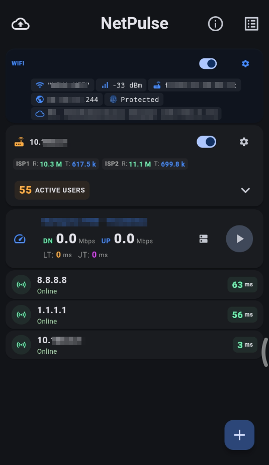

# NetPulse

NetPulse is a lightweight and powerful network diagnostic tool built with Flutter. It provides essential tools for monitoring host availability, analyzing WiFi connections, performing speed tests, and managing MikroTik routers.

## Features

- **Multi-Host Ping Monitor**: Monitor multiple IP addresses or domains simultaneously with real-time latency updates and status history.
- **WiFi Insights**: Get detailed information about your current WiFi connection, including SSID, BSSID, Signal Strength, and local IP.
- **Speed Test**: Measure your download, upload, latency, and jitter using various test servers.
- **MikroTik Integration**: Monitor traffic and system resources (CPU, Memory, Uptime) for MikroTik routers via API.
- **History & Logging**: Keep track of previous diagnostic results and view detailed internal logs.
- **Backup & Restore**: Easily export and import your monitored hosts and settings via JSON or file.
- **Cross-Platform**: Designed for Android and Linux with a modern Material 3 Dark UI.

## Getting Started

### Prerequisites

- Flutter SDK (v3.10.7 or higher)
- Android Studio / VS Code with Flutter extension
- For Linux: `libnm` and other standard development headers

### Installation

1. **Clone the repository:**
   ```bash
   git clone https://github.com/ginkohub/netpulse.git
   cd netpulse
   ```

2. **Install dependencies:**
   ```bash
   flutter pub get
   ```

3. **Run the application:**
   ```bash
   # Run on connected device or emulator
   flutter run
   ```

### Building for Production

#### Android
```bash
flutter build apk --release
```

#### Linux
```bash
flutter build linux --release
```

## Technologies Used

- **Framework**: [Flutter](https://flutter.dev)
- **State Management**: [Provider](https://pub.dev/packages/provider)
- **Network Tools**:
  - `dart_ping` for ICMP monitoring.
  - `router_os_client` for MikroTik API.
  - `wifi_iot` & `network_info_plus` for WiFi details.
- **UI Components**: `fl_chart` for visual data.
- **Storage**: `shared_preferences` for persistence.

## Screenshot


## Contributing

Contributions are welcome! Please feel free to submit a Pull Request or open an issue for bugs and feature requests.

## License

This project is private and for internal use at Ginkohub.
